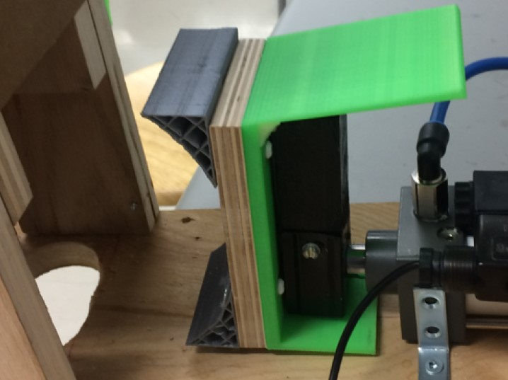
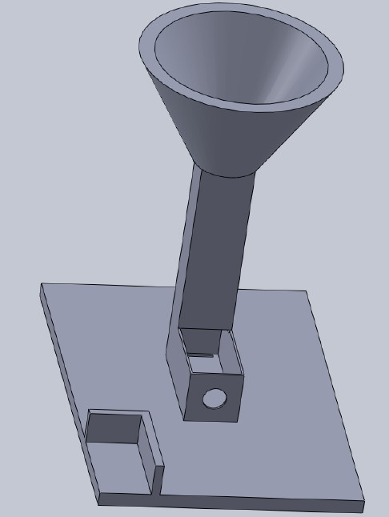

<!-- PROJECT LOGO -->
<br />
<p align="center">
  <a >
       
  </a>

  <h3 align="center">Can Crusher</h3>

  <p align="center">
    Fully automated can crusher made over 3 weeks using Arudino, Solidworks, IR sensors, Solenoids, H-Bridges and more.
    <br />
    <br />
    <a href="https://github.com/hassanali1228/Can-Crusher/blob/master/FILLETeers%20Design%20Booklet.pdf">View Design Booklet </a>
    |
    <a> By The Filleteers</a>
  </p>
</p>

<!-- ABOUT THE PROJECT -->
## About The Project

The design challenge was to design a can crusher which crushes sideways rather than downwards, to yield the highest recyclable surface area. This was a structural challenge, that was approached by adding triangular supports on the crushing way. These helped the discs on the can fold inward.

<p align="left">
  <a >
       
  </a>
</p>

The project was completely automated with the use of two IR sesors. One sensed when a can was present to be crushed, and the other sensor checked when that can had left the system throught the slot. In case of an emergency, a stop button was present. Furthermore, to make crushing cans fun, a hoop was incorporated in the form of a cone. This was made using acrylic for aesthetics, and so that the user could see their can get oriented appopriately.

<p align="left">
  <a >
       
  </a>
</p>

### Software Used

* [Arudino](https://www.arduino.cc/)
* [Solidworks](https://www.solidworks.com/)
* [Fritzing](https://fritzing.org/)
* [Lucidpress](https://www.lucidpress.com/pages/)

<!-- GETTING STARTED -->
## Getting Started

You can download the project files, and run in them in their respective programs.

### Installation

1. Clone the repo
   ```sh
   git clone https://github.com/hassanali1228/Can-Crusher.git
   ```
2. Install Arduino IDE.
   ```sh
   https://www.arduino.cc/en/software
   ```
3 Install any compatible 3d modelling software with .SLDPRT files.
